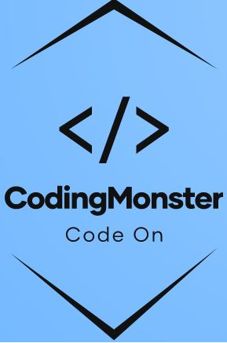
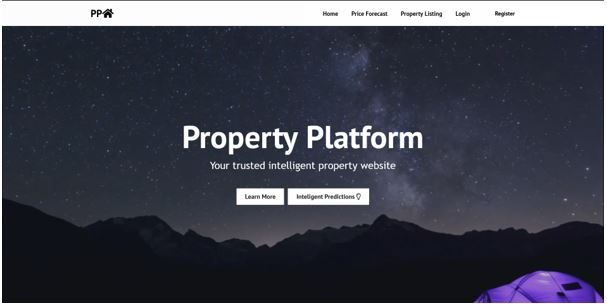

<!--
*** You are not suppose to be here but okay.
*** This is a reference to another Github readme temple
*** https://github.com/othneildrew/Best-README-Template/blob/master/README.md
*** Basically that's all I want to say. Good Luck and have fun. 
-->

# House Price Prediction Web Application
Final Year Project on House Price Prediction Year 2021

[![Contributors][contributors-shield]][contributors-url]
[![Forks][forks-shield]][forks-url]
[![Issues][issues-shield]][issues-url]
[![MIT License][license-shield]][license-url]
[![LinkedIn][linkedin-shield]][linkedin-url]

<!--------------------------------------------------------------------- THIS IS SEPERATION LINE-------------------------------------------------------------------->

<!-- PROJECT LOGO -->
<br />
<p align="center">
  <a href="https://github.com/kin9787/Ferry-Ticketing-System-Assignment">
    
  </a>
  
  <h3 align="center">House Price Prediction Web Application</h3>

  <p align="center">
    A House Price Prediction Web Application!
    <br />
    <a href="https://github.com/kin9787/Final-Year-Project-2021"><strong>Explore the docs »</strong></a>
    <br />
    <a href="https://github.com/kin9787/Final-Year-Project-2021/issues">Report Bug</a>
    ·
    <a href="https://github.com/kin9787/Final-Year-Project-2021/issues">Request Feature</a>
  </p>
</p>

<!--------------------------------------------------------------------- THIS IS SEPERATION LINE-------------------------------------------------------------------->


<!-- TABLE OF CONTENTS -->
<details open="open">
  <summary>Table of Contents</summary>
  <ol>
    <li>
      <a href="#about-the-project">About The Project</a>
      <ul>
        <li><a href="#built-with">Built With</a></li>
      </ul>
    </li>
    <li>
      <a href="#getting-started">Getting Started</a>
      <ul>
        <li><a href="#prerequisites">Prerequisites</a></li>
        <li><a href="#installation">Installation</a></li>
      </ul>
    </li>
    <li><a href="#usage">Usage</a></li>
    <li><a href="#roadmap">Roadmap</a></li>
    <li><a href="#license">License</a></li>
    <li><a href="#contact">Contact</a></li>
  </ol>
</details>

<!--------------------------------------------------------------------- THIS IS SEPERATION LINE-------------------------------------------------------------------->

<!-- ABOUT THE PROJECT -->
## About The Project
<p align="center">
    
</p>

<!-- [![Product Screen Shot][product-screenshot]](https://github.com/kin9787/Final-Year-Project-2021/blob/master/images/FYPExample.JPG) -->

This project is a final year project. A house price prediction web application is built using React JS as front-end, NodeJs as Middleware and XAMPP as backend.

Some useful reference and resoucrs that I find helpful are listed in the acknowledgements.

<!--------------------------------------------------------------------- THIS IS SEPERATION LINE-------------------------------------------------------------------->
<!-- Built With -->
### Built With

The web application is build in a 3-tier architecture, [React](https://reactjs.org/) as Front-end , [NodeJS](https://nodejs.org/en/) as Middleware and [XAMPP](https://www.apachefriends.org/index.html) as backend database.
* [ReactJS](https://reactjs.org/)
* [NodeJS](https://nodejs.org/en/)
* [XAMPP](https://www.apachefriends.org/index.html)

<!--------------------------------------------------------------------- THIS IS SEPERATION LINE-------------------------------------------------------------------->

<!-- GETTING STARTED -->
## Getting Started

To get a local copy follow the simple steps in the [installation](#installation) section.

<!--------------------------------------------------------------------- THIS IS SEPERATION LINE-------------------------------------------------------------------->

### Prerequisites

The list below are the frameworks that you need to run the system. You can use this [tutorial](https://www.liquidweb.com/kb/install-react-js-windows/) to setup ReactJS and NodeJS framework.

* [ReactJS](https://reactjs.org/)
* [NodeJS](https://nodejs.org/en/)
* [XAMPP](https://www.apachefriends.org/index.html)

<!--------------------------------------------------------------------- THIS IS SEPERATION LINE-------------------------------------------------------------------->

### Installation

1. Clone the repo
   ```sh
   git clone https://github.com/kin9787/Final-Year-Project-2021.git
   ```
2. Within the folder, summon the terminal and install NPM packages using the code below.
   ```sh
   npm install
   ```

<!--------------------------------------------------------------------- THIS IS SEPERATION LINE-------------------------------------------------------------------->

<!-- USAGE EXAMPLES -->
## Usage

This repo acts as a reference to those who want to build a simple 3-tier web application using ReactJS, NodeJS and XAMPP. A machine leanring model is also added to this project which can be use to predict house price.

_For more examples, please refer to the author by contact him_

<!--------------------------------------------------------------------- THIS IS SEPERATION LINE-------------------------------------------------------------------->

<!-- ROADMAP -->
## Roadmap

See the [open issues](https://github.com/othneildrew/Best-README-Template/issues) for a list of proposed features (and known issues).
   
<!--------------------------------------------------------------------- THIS IS SEPERATION LINE-------------------------------------------------------------------->   

<!-- LICENSE -->
## License

Distributed under... myself. See `LICENSE` for more information.

<!--------------------------------------------------------------------- THIS IS SEPERATION LINE-------------------------------------------------------------------->

<!-- CONTACT -->
## Contact

Your Name - Chen Chee Kin

Email - chencheekin1234@gmail.com

Project Link: [https://github.com/kin9787/Final-Year-Project-2021](https://github.com/kin9787/Final-Year-Project-2021)

<!--------------------------------------------------------------------- THIS IS SEPERATION LINE-------------------------------------------------------------------->

<!-- MARKDOWN LINKS & IMAGES -->
<!-- https://www.markdownguide.org/basic-syntax/#reference-style-links -->
[contributors-shield]: https://img.shields.io/github/contributors/kin9787/kin9787.svg?style=for-the-badge
[contributors-url]: https://github.com/kin9787/Final-Year-Project-2021/graphs/contributors
[forks-shield]: https://img.shields.io/github/forks/kin9787/kin9787.svg?style=for-the-badge
[forks-url]: https://github.com/kin9787/Final-Year-Project-2021/network/members
[issues-shield]: https://img.shields.io/github/issues/kin9787/kin9787.svg?style=for-the-badge
[issues-url]: https://github.com/kin9787/Final-Year-Project-2021/issues
[license-shield]: https://img.shields.io/github/license/kin9787/kin9787.svg?style=for-the-badge
[license-url]: https://github.com/kin9787/Final-Year-Project-2021/blob/main/LICENSE.txt
[linkedin-shield]: https://img.shields.io/badge/-LinkedIn-black.svg?style=for-the-badge&logo=linkedin&colorB=555
[linkedin-url]: https://www.linkedin.com/in/chen-chee-kin-2b6664157/
[product-screenshot]: images/FYPExample.JPG

<!--FORK REQUEST-->
